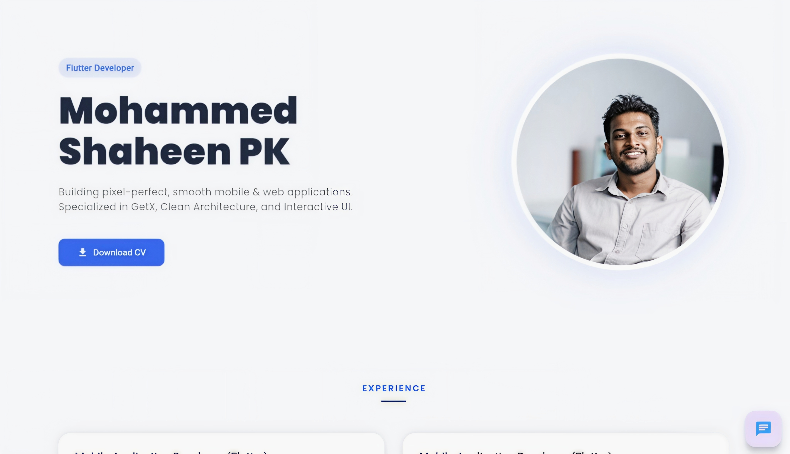
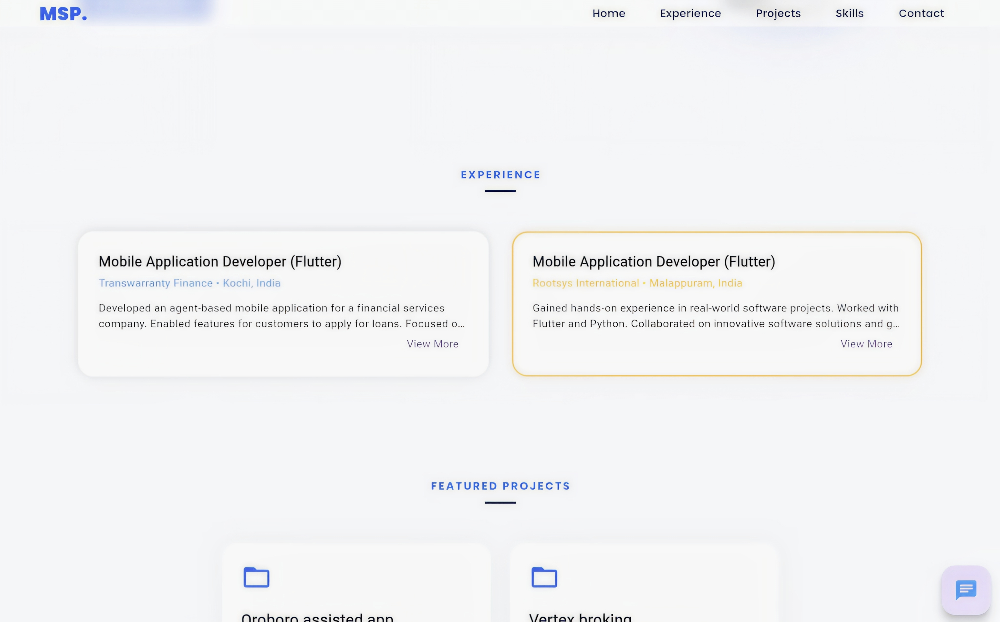
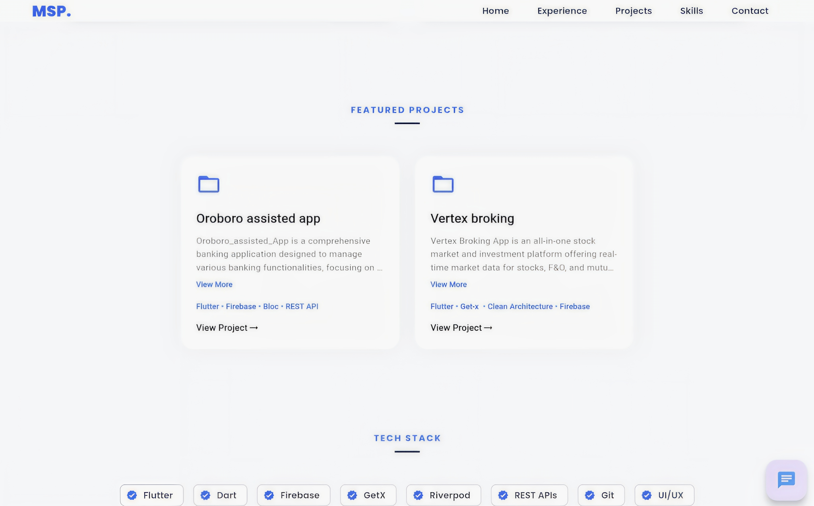
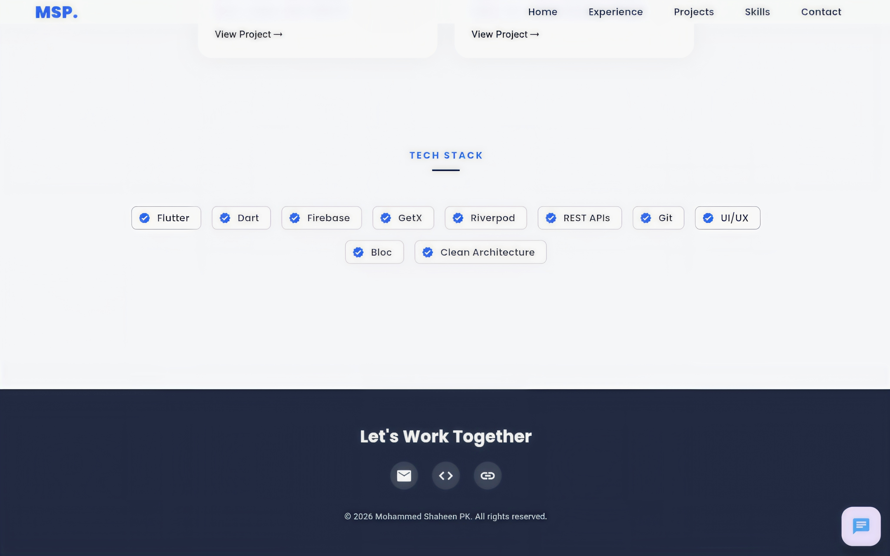

# 🌐 Flutter Web Portfolio

This is my personal portfolio website built entirely using **Flutter Web**.

## 🚀 About the Project
This portfolio showcases my skills, projects, and experience as a Flutter Developer.  
The entire application is developed using Flutter, ensuring a consistent UI and performance across platforms.

## 💡 Key Highlights
- Built using **Flutter (Dart)**
- Fully responsive design for web
- Smooth animations and modern UI
- Cross-platform capability (Web + Mobile ready)
- No usage of traditional **HTML, CSS, or JavaScript**

## 🛠️ Tech Stack
- Flutter
- Dart
- REST API Integration (if applicable)
- Responsive UI Design

## 📂 Features
- 👨‍💻 About Me Section
- 📱 Projects Showcase
- 📞 Contact Information
- 🌐 Social Media Links

## 🎯 Purpose
This project demonstrates how Flutter can be used to build fully functional web applications without relying on traditional web technologies.

## 🔗 Live Demo
https://myportfolio-fb771.web.app/

## 📸 Screenshots

| Home | Experience |
|------|----------|
|  |  |

| Projects  | Tech Stack / contact  |
|-------|---------|
|  |  |

---

## 👨‍💻 About Me
Flutter Developer with 2+ years of experience in building cross-platform mobile and web applications.

---

## 🔗 Connect With Me
- LinkedIn: https://linkedin.com/in/mohammedshaheenpk
- Email: shaheenshaheenpk2000@gmail.com
- phone : 8606648604

---

⭐ If you like this project, give it a star!

